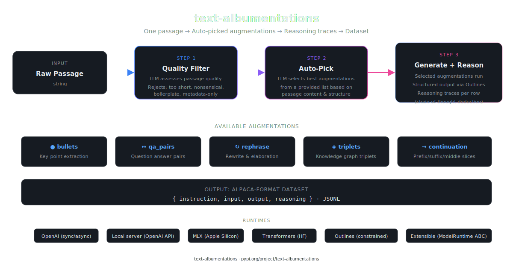

# text-albumentations

`text-albumentations` is a synthetic data generation engine for text.
The goal is to help generate instruction-tuning and distillation datasets from existing text corpora by applying structured augmentations over passages.

This is built for the practical case where good supervised fine-tuning often requires more examples than you already have, and where synthetic data generation is one of the fastest ways to create task-shaped training data from raw documents.




If you find this helpful, consider supporting on Patreon — it hosts all code, projects, slides, and write-ups from the YouTube channel.

[](https://www.patreon.com/NeuralBreakdownwithAVB)

## Quickstart

Install via pip (or uv):
```
pip install text_albumentations
```

And use:

```python
import text_albumentations as ta

# A model is its own thing — build it once, point it anywhere:
model = ta.OpenAIModel(
    "gpt-5-mini",
    base_url="https://api.openai.com/v1",
    api_key="sk-...",
)

# A smart-switch picks the right augmentations and filters low-quality passages:
rows = ta.augment("Your passage of text here...", model=model)

# Or choose tasks explicitly:
rows = ta.augment(
    "Your passage of text here...",
    tasks=["summarize", "qa_pairs", "title"],
    model=model,
)

ta.save(rows, "train.jsonl")   # appends Alpaca-format rows as JSONL
```

Model primitives:

- `ta.OpenAIModel(...)` — any OpenAI-compatible endpoint (OpenAI, local MLX server, vLLM, Ollama). Falls back to the `TEXT_ALBUMENTATIONS_MODEL`, `OPENAI_BASE_URL`, and `OPENAI_API_KEY` environment variables, so a configured shell needs only `ta.augment(text)`.
- `ta.LocalMLXModel("mlx-community/...")` — an MLX model loaded in-process (Apple Silicon).
- `ta.LocalHFModel("Qwen/Qwen3.5-2B")` — a Hugging Face Transformers model loaded in-process.

`ta.list_tasks()` returns every built-in single-passage task name with a one-line hint of when it fits. When you need more control, `tasks=` also accepts configured augmentation instances (e.g. `BulletAugmentation(max_bullets=4)`) — everything below stays available.

Defining your own task takes a schema and a prompt:

```python
from pydantic import BaseModel, Field

class KeyStat(BaseModel):
    statistic: str = Field(max_length=200)
    context: str = Field(max_length=300)

key_stat = ta.task(
    prompt="Extract the single most important statistic from this passage.",
    schema=KeyStat,
    output="{statistic} — {context}",   # template over schema fields
)

rows = ta.augment(passage, tasks=[key_stat, "summarize"], model=model)
```

The schema is enforced exactly via structured generation. `output=` also takes a callable, `rows=` gives full control over emitted rows, and generation knobs (`temperature=`, `variations=`, ...) pass straight through. Subclassing `BaseSingleChunkAugmentation` remains available for tasks that need custom input types or programmatic generation.


## Why This Exists

Modern LLM workflows often need:

- synthetic SFT data
- task-specific distillation data
- multiple renderings of the same semantic content
- structured supervision generated from long-form text

If you already have long amounts of text, you can usually derive many useful supervision targets from it:

- bullet-point summaries
- QA pairs (free-form and extractive)
- rephrasings and style transfers
- summaries, titles, and headlines
- continuation and cloze (fill-in-the-blank) tasks
- retrieval examples
- comparisons
- knowledge graph triplets
- classification labels
- backtranslated instructions and counterfactuals

Instead of treating synthetic data generation as one giant prompt, this project breaks it into explicit, composable pieces.

## Ideology

The core idea is:

`structured generation + simple priors -> dataset`

Structured generation gives you typed intermediate outputs using Pydantic schemas.

Simple priors give you the task shape:

- "extract bullets"
- "produce QA pairs"
- "find the answering passage"
- "serialize the response as markdown/json/etc"

That combination is easier to reason about than unstructured free-form prompting. It also makes the pipeline more extensible: you can swap prompts, schemas, response formats, models, and adapters without rewriting the whole system.

## Current Capabilities

The project currently supports:

- **one-call generation**: `ta.augment(text, model=model)` is the whole pipeline
- **auto-pick (smart switch)**: LLM-driven selection of which augmentations fit a given passage, guided by per-task `selection_hint`s and grammar-constrained to real task names
- **quality filter**: automatic rejection of low-quality passages before generation
- **reasoning traces**: post-hoc CoT reasoning generated for each training row
- **terse custom tasks**: `ta.task(prompt=..., schema=...)` defines a new augmentation without classes
- single-chunk and multi-chunk augmentations
- batched augmentation execution for many passages with one shared schema
- typed structured outputs with Pydantic
- Alpaca-format dataset generation
- response-format control for the Alpaca `output` field
- sync and async generation
- model primitives: `OpenAIModel` (any OpenAI-compatible endpoint), `LocalMLXModel`, `LocalHFModel`
- long-text ingestion with fixed-size character chunking
- JSONL dataset writing

Built-in augmentations:

| Augmentation | What it generates |
| --- | --- |
| `bullets` | Extracts key points from a passage and renders them as bullet-style outputs. |
| `qa_pairs` | Produces question-answer pairs grounded in one passage. |
| `rephrase` | Rewrites a passage into a clearer or more elaborated version without changing meaning. |
| `continuation` | Programmatically slices the passage into prefix/suffix continuation rows (LLM-free). |
| `triplets` | Extracts subject-relation-object knowledge graph triplets. |
| `summarize` | Produces a one-sentence TLDR and a short prose summary of the passage. |
| `title` | Generates a short descriptive title and a one-sentence headline. |
| `cloze` | Programmatically masks salient words and a middle sentence, producing fill-in-the-blank rows (LLM-free). |
| `extractive_qa` | Generates questions answered by verbatim quotes from the passage; quotes are verified against the source before a row is kept. |
| `classification` | Labels the passage with topic, tone, and intended audience via constrained generation. |
| `style_transfer` | Rewrites the passage in a target style (`eli5`, `formal`, `casual`, or a custom description). |
| `backtranslation` | Generates the instruction the passage would be the ideal answer to (instruction backtranslation); the passage itself becomes the output. |
| `counterfactual` | Alters a central claim of the passage and asks what would follow, with a passage-grounded answer. |
| `comparison` | Compares two passages and generates a structured comparison. |
| `retrieval` | Builds retrieval-style supervision by pairing questions with the passage that answers them, or with no-answer cases. |

## Architecture

The main abstractions are:

- **Models** (`OpenAIModel`, `LocalMLXModel`, `LocalHFModel`)
  Where generation runs. Build one, pass it everywhere — both `ta.augment` and every lower-level API take the same object. All implement the `ModelRuntime` interface, which you can implement yourself for a new backend.

- **Tasks / Augmentations** (`ta.task(...)`, `BaseSingleChunkAugmentation`, `BaseMultiChunkAugmentation`)
  What to generate from a passage. A task is a Pydantic schema (enforced exactly via structured generation), a `system_prompt` for the augmenter model, a `selection_hint` for the smart switch, and adapters that turn outputs into training rows.

- `BaseAlpacaAdapter`
  Converts one typed structured output into one or more Alpaca rows.

- `BaseResponseFormat`
  Controls how the Alpaca `output` field is represented and can modify the system prompt with format-specific instructions.

- `MetaAugmentation` (the smart switch)
  Auto-picks which augmentations to apply — reading each task's `selection_hint` — and filters low-quality passages. Its task choices are grammar-constrained to the actual task names, so it cannot select something that doesn't exist.

## Usage

### Install

```bash
uv add text-albumentations
```

PyPI package: https://pypi.org/project/text-albumentations/

### Models

Build a model once and pass it everywhere. Every API in the library — from `ta.augment` down to `run_augmentation` — takes the same model object.

**Any OpenAI-compatible endpoint** (OpenAI, local MLX server, vLLM, Ollama):
```python
model = ta.OpenAIModel("gpt-5-mini",
                       base_url="https://api.openai.com/v1",
                       api_key="sk-...")
```

All three arguments fall back to environment variables (`TEXT_ALBUMENTATIONS_MODEL`, `OPENAI_BASE_URL`, `OPENAI_API_KEY`), so a configured shell can just call `ta.OpenAIModel()` — or skip the model entirely and call `ta.augment(text)`.

**In-process local models:**
```python
model = ta.LocalMLXModel("mlx-community/Qwen3.5-4B-OptiQ-4bit")   # Apple Silicon
model = ta.LocalHFModel("google/gemma-3-1b-it")                   # Transformers
```

For async pipelines, `OpenAIModel` takes `async_mode=True` and `total_concurrent_calls=`:
```python
model = ta.OpenAIModel("gpt-5-mini", base_url=..., api_key=...,
                       async_mode=True, total_concurrent_calls=4)
```

A new backend is one class away: implement the `ModelRuntime` interface and pass your object anywhere a model is accepted.

### Recommended: Auto-Pick With Quality Filter

The default mode of `ta.augment` is the smart switch: an LLM assesses passage quality (rejecting too-short, nonsensical, or boilerplate text), then selects only the augmentations well-suited to the passage's content and structure.

```python
import text_albumentations as ta

model = ta.OpenAIModel("gpt-5-mini", base_url=..., api_key=...)

rows = ta.augment(
    "The Transformer replaces recurrence with attention and improves parallelization. "
    "It achieved 28.4 BLEU on WMT 2014 English-to-German.",
    model=model,
)

for row in rows:
    print(row.model_dump_json())
```

#### How the selector decides

Each augmentation carries a `selection_hint` — a one-liner describing *when* the task fits a passage. This is deliberately distinct from `system_prompt`: the hint is read only by the selector LLM, while the system prompt is what the augmenter model sees. The selector's menu looks like:

```
- triplets: pick when the passage states relationships between named entities or concepts.
- extractive_qa: pick when specific facts in the passage can be quoted verbatim as answers.
```

Its choices are grammar-constrained (via a `Literal` over the actual task names), so it cannot hallucinate a task that doesn't exist.

To include custom tasks in auto-pick, use the lower-level `apply_best_augmentations` with `(name, augmentation)` pairs — the hint comes from each augmentation's `selection_hint` attribute (set via `ta.task(..., selection_hint="...")`, a class attribute, or a third tuple element as an override):

```python
from text_albumentations import apply_best_augmentations
from text_albumentations.tasks import bullet_augmentation, summarize_augmentation

key_stat = ta.task(
    prompt="Extract the single most important statistic from this passage.",
    schema=KeyStat,
    output="{statistic} — {context}",
    selection_hint="the passage contains a notable number or metric.",
)

rows = apply_best_augmentations(
    passage,
    [
        ("bullets", bullet_augmentation),
        ("summarize", summarize_augmentation),
        ("key_stat", key_stat),
    ],
    model,
)
```

#### With Reasoning Traces

Add `add_reasoning=True` to generate a Chain-of-Thought reasoning trace for every training row:

```python
rows = ta.augment(passage, model=model, add_reasoning=True)
```

Each output row gets a `reasoning` field containing a step-by-step logical trace explaining how the response was derived from the passage and instruction.

#### Auto-Pick With Async

```python
import asyncio
import text_albumentations as ta
from text_albumentations import aapply_best_augmentations
from text_albumentations.tasks import bullet_augmentation, qa_pair_augmentation

async def main():
    model = ta.OpenAIModel("gpt-5-mini",
                           base_url="https://api.openai.com/v1",
                           api_key="sk-...",
                           async_mode=True, total_concurrent_calls=4)
    rows = await aapply_best_augmentations(
        passage,
        [("bullets", bullet_augmentation), ("qa_pairs", qa_pair_augmentation)],
        model,
    )
    print(len(rows))

asyncio.run(main())
```

### Choosing Tasks Explicitly

Pass `tasks=` to skip the smart switch. Names and configured instances mix freely:

```python
from text_albumentations.tasks.bullets import BulletAugmentation

rows = ta.augment(
    passage,
    tasks=["summarize", "qa_pairs", BulletAugmentation(max_bullets=4, variations=2)],
    model=model,
)
```

`ta.list_tasks()` returns every built-in task name with its selection hint. The lower-level equivalent is `run_augmentation(passage, augmentation, model)` for one augmentation at a time.

Note: `ta.augment` operates on a single passage, so it covers the single-chunk tasks. The multi-chunk tasks (`comparison`, `retrieval`) take a list of passages and run through `run_augmentation` directly:

```python
from text_albumentations import run_augmentation
from text_albumentations.tasks import comparison_augmentation

rows = run_augmentation([passage_a, passage_b], comparison_augmentation, model)
```

### Reasoning Traces (Standalone)

You can add reasoning traces to any existing dataset, even if you didn't generate them with `add_reasoning=True`:

```python
from text_albumentations.reasoning import add_reasoning_to_dataset

rows = ta.augment(passage, tasks=["bullets"], model=model)
rows_with_reasoning = add_reasoning_to_dataset(passage, rows, model)
```

Each row gets a `reasoning` field with a Chain-of-Thought trace. Available functions:

| Function | Description |
| --- | --- |
| `generate_reasoning(passage, row, model)` | Add reasoning to a single row |
| `add_reasoning_to_dataset(passage, dataset, model)` | Add reasoning to all rows |
| `agenerate_reasoning(...)` / `aadd_reasoning_to_dataset(...)` | Async variants |

### Batch Augmentation Over Multiple Passages

```python
from text_albumentations import run_batch_augmentation
from text_albumentations.tasks.bullets import BulletAugmentation

augmentation = BulletAugmentation(max_tokens=128, variations=0)

rows = run_batch_augmentation(
    [
        "The Transformer replaces recurrence with attention and improves parallelization.",
        "Outlines constrains generation so outputs match the expected structure.",
        "Synthetic supervision can be derived from raw documents with task-shaped prompts.",
        "Batch decoding is useful when many passages share the same schema and augmentation.",
    ],
    augmentation,
    model,
)
```

### Long Text To JSONL

```python
from text_albumentations import save_long_text_dataset
from text_albumentations.tasks.bullets import bullet_augmentation

save_long_text_dataset(
    text=long_text,
    output_jsonl="out.jsonl",
    augmentation=bullet_augmentation,
    runtime=model,
    chunk_size_chars=300,
)
```

### Augmentation Knobs

Every augmentation accepts these parameters to control generation behavior:

| Parameter | Default | Description |
| --- | --- | --- |
| `temperature` | 0.2 | Sampling temperature for base generation (tasks override: e.g. `rephrase` 0.5, `counterfactual` 0.7) |
| `max_tokens` | 5000 | Max tokens for base generation |
| `num_generations` | 1 | Number of independent base generations |
| `variations` | 0 | Extra paraphrased variations per base generation (`bullets` defaults to 1) |
| `variation_temperature` | 0.5 | Temperature used for variation generation |

Customize per-augmentation parameters:

```python
aug = BulletAugmentation(
    max_bullets=4,
    temperature=0.3,
    variations=3,
    variation_temperature=0.7,
)
```

### Custom Preprocessing Model

You can also make the augmentation input itself be a custom Pydantic model instead of a raw string.

See [`examples/custom_preprocessing.py`](examples/custom_preprocessing.py).

## Extensibility

The project is designed so users can extend it in layers.

### 1. Define A Task With `ta.task`

For most custom tasks, no class is needed — a schema and a prompt are enough:

```python
key_stat = ta.task(
    prompt="Extract the single most important statistic from this passage.",
    schema=KeyStat,
    output="{statistic} — {context}",          # template over schema fields
    selection_hint="the passage contains a notable number or metric.",
)
```

- `output=` — a template string, a callable `(output) -> str`, or omitted when the schema has exactly one field
- `instruction=` — the training row's instruction, when it should differ from the prompt
- `rows=` — full control: a callable `(passage, output) -> list[AlpacaDataset]` emitting any number of rows
- `selection_hint=` — lets the smart switch know when to pick this task
- generation knobs (`temperature=`, `variations=`, ...) pass straight through

### 2. Add A New Augmentation Class

Subclass `BaseSingleChunkAugmentation` or `BaseMultiChunkAugmentation` when a task needs custom input types, programmatic (LLM-free) generation, or verification logic. Define:

- a Pydantic schema
- a `system_prompt` (sent to the augmenter model)
- a `selection_hint` (read by the smart switch — never sent to the augmenter)
- adapters and/or response formats
- optionally `build_user_message(...)`, `validate_passages(...)`, or `generate_one(...)`

### 3. Add A New Response Format

Subclass `BaseResponseFormat` if you want to control:

- how the format modifies the system prompt
- how the final Alpaca `output` field is rendered

For common Alpaca row generation, `AlpacaResponseFormat` is usually enough.

### 4. Add A New Adapter

Subclass `BaseAlpacaAdapter` to convert a typed structured output into one or more Alpaca rows.

One structured output can expand into multiple rows.

### 5. Add A New Model Backend

Implement the `ModelRuntime` interface if you want a backend beyond the built-in `OpenAIModel` / `LocalMLXModel` / `LocalHFModel` primitives. Your object then works everywhere a model is accepted.

That keeps model execution separate from:

- augmentation semantics
- prompt construction
- dataset adapters
- response serialization

This separation is intentional. The project should let you swap the model layer without rewriting the dataset logic.

## Tests

```bash
uv run pytest -m "not integration"   # offline suite (no model needed)
uv run pytest                        # + integration tests against a local OpenAI-compatible server on :8080
```

## Philosophy On Synthetic Data

This project does not assume synthetic data is magic.

It assumes:

- synthetic data works best when the task shape is explicit
- typed intermediate representations are easier to control
- simple priors beat vague giant prompts
- extensibility matters because different teams want different schemas, formats, and runtimes

The aim is not "generate random data."

The aim is to turn raw text into useful supervision signals for SFT and distillation in a way that is structured, inspectable, and easy to extend.
